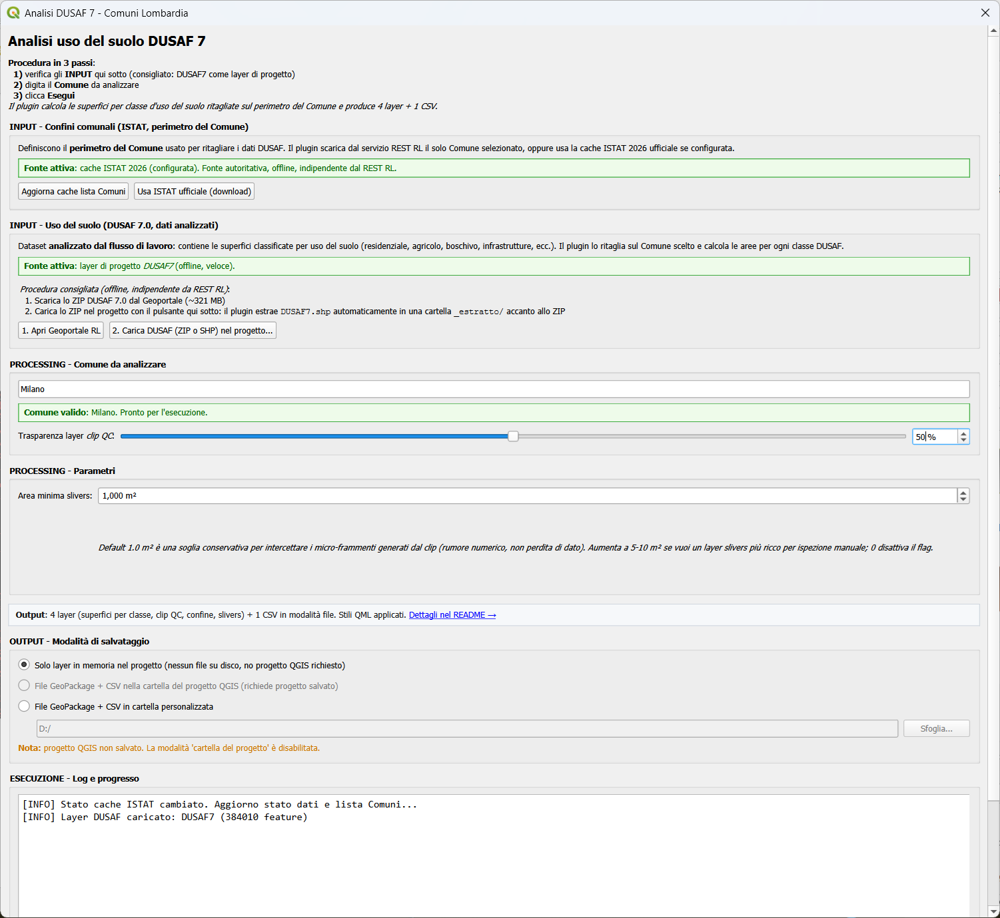
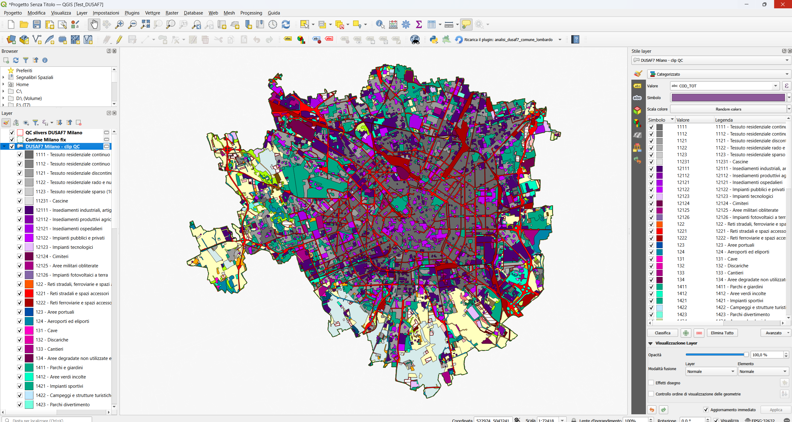
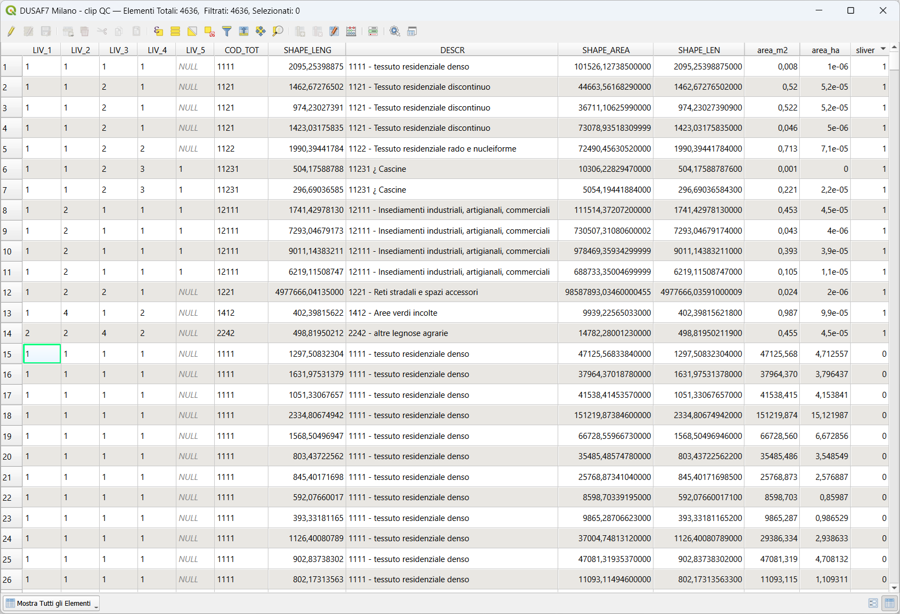
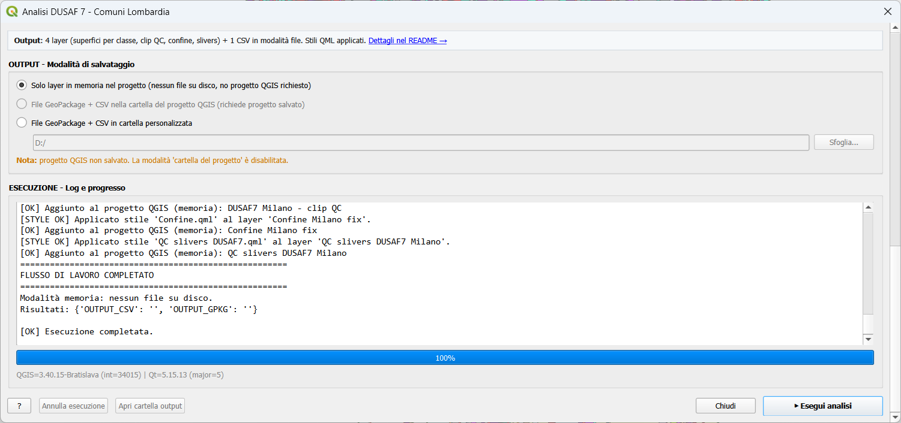

# QGIS Plugin DUSAF 7 - Comuni Lombardi

Plugin QGIS per l'analisi automatizzata dell'uso del suolo nei Comuni
lombardi, basato sul dataset **DUSAF 7.0** di Regione Lombardia e sui
**confini amministrativi** ufficiali.

Il plugin guida l'utente in **3 passi**:
1. verifica delle fonti dati **INPUT** (consigliato: DUSAF7 come
   layer di progetto, caricabile direttamente da ZIP del Geoportale RL);
2. selezione del **Comune** da analizzare con autocomplete su tutti
   i ~1500 Comuni lombardi;
3. esecuzione del flusso di lavoro, che produce 4 layer + 1 CSV
   con superfici per classe d'uso del suolo, percentuali e audit QC-4.

Funziona anche **senza preloading**: i dati vengono presi al volo dai
servizi REST di Regione Lombardia. Compatibile con QGIS **3.34 fino a
4.0+** (testato fino a QGIS 4.0 Norrköping).

## Screenshots

### Dialog principale - primo uso

L'interfaccia presenta tre macro-sezioni dichiarate (**INPUT** confini
e DUSAF, **PROCESSING** Comune e parametri, **OUTPUT** modalità di
salvataggio). Quando DUSAF7 non è ancora caricato come layer di
progetto, un banner rosso suggerisce la procedura consigliata (offline,
indipendente da REST).


### Dialog pronto all'esecuzione

Con DUSAF7 caricato come layer di progetto (drag&drop o pulsante
"Carica DUSAF ZIP/SHP"), il banner rosso scompare automaticamente e i
badge diventano verdi. Lo slider trasparenza permette di regolare
l'opacità del layer di output `clip QC` direttamente dal dialog
(utile per sovrapporre il DUSAF a un'ortofoto sottostante).



### Output sulla mappa

Esempio di esecuzione su **Milano**: i 4 layer di output appaiono nel
progetto con gli stili QML applicati automaticamente (categorizzazione
DUSAF a tutti i livelli LIV3/LIV4/LIV5: residenziale, agricolo,
boschivo, reti stradali e ferroviarie, impianti pubblici, ecc.). A
fine esecuzione il canvas zooma automaticamente sul Comune
processato.



### Tabella attributi per classe

Il layer principale `DUSAF7 <Comune> - superfici ha %` contiene una
feature per ogni classe DUSAF presente nel Comune, con le statistiche
aggregate: `area_m2`, `area_ha`, `pct_dusaf` (% sul totale DUSAF
clippato) e `pct_comune` (% sul perimetro del Comune).



### Log di esecuzione + Data Audit QC-4

Al termine il pannello "ESECUZIONE - Log e progresso" riepiloga le 9
fasi del flusso di lavoro e mostra l'audit QC-4 con il confronto
tra superficie del perimetro comunale e somma delle aree DUSAF
aggregate. Tolleranza fissa di **1.0 m²** sulla differenza assoluta.



## Compatibilità

- **QGIS**: 3.34 → 4.99
- **Qt**: 5 e 6
- Nessuna dipendenza Python esterna (solo `urllib` standard library)

## Installazione

1. Scarica lo ZIP dalla sezione Release del repository.
2. In QGIS: `Plugin → Gestisci e installa plugin → Installa da ZIP`.

## Come funziona

### Apertura

Click sul pulsante <kbd>Analisi DUSAF 7 - Comune Lombardo</kbd> nella
barra strumenti di QGIS (icona albero/foglia). Si apre il dialog
principale.

L'algoritmo Processing resta disponibile in
`Processing Toolbox → Analisi DUSAF 7 → Analisi Territoriale` per chi
preferisce richiamarlo da Model Designer o da script Python.

### Stato dati - sezione INPUT

Il dialog divide le fonti dati in due sotto-sezioni dichiarate:

- **INPUT - Confini comunali (ISTAT)**: definisce il perimetro del
  Comune usato per ritagliare il DUSAF.
- **INPUT - Uso del suolo (DUSAF 7.0)**: il dataset analizzato dal
  flusso di lavoro.

Per ogni sotto-sezione un badge sintetico indica la fonte attiva:

| Badge | Significato |
|---|---|
| 🟢 verde *layer di progetto* | Esiste già nel progetto un layer riconosciuto. Usato as-is (back-compat). |
| 🟢 verde *cache ISTAT 2026* | È stata configurata la cache ISTAT ufficiale tramite il setup opzionale. |
| 🔵 azzurro *REST Regione Lombardia* | Default: i dati vengono scaricati al volo dal servizio REST RL. |

Priorità DUSAF: **layer di progetto → REST RL**.
Priorità Confini: **layer di progetto → cache ISTAT → REST RL**.

### Lista Comuni (autocomplete)

Al primo avvio la lista dei ~1500 Comuni lombardi viene scaricata
dal servizio REST e salvata in cache nel profilo QGIS
(`<profile>/analisi_dusaf7_comune_lombardo/cache/comuni_list_lombardia.json`,
TTL 30 giorni). Avvii successivi caricano la lista istantaneamente.

Il pulsante <kbd>Aggiorna cache lista Comuni</kbd> forza un nuovo
fetch ignorando la cache.

L'autocomplete è case-insensitive e a match per sottostringa: digitando
"zibido san" trovi "Zibido San Giacomo".

### Caricare DUSAF7 dal Geoportale RL (consigliato)

Il servizio REST DUSAF di Regione Lombardia ha **interruzioni
frequenti** (risposta `Failed to execute query..`). Per lavorare in
modo robusto e veloce è fortemente consigliato caricare DUSAF7 come
layer di progetto:

1. <kbd>1. Apri Geoportale RL</kbd> → si apre il browser sulla pagina
   ufficiale del Geoportale di Regione Lombardia, sezione
   "Pacchetti scaricabili - DUSAF 7.0".
2. Scarica lo ZIP (`~321 MB` compresso).
3. <kbd>2. Carica DUSAF (ZIP o SHP) nel progetto</kbd> → seleziona
   direttamente lo ZIP appena scaricato.
4. Il plugin **estrae automaticamente** `DUSAF7.shp` + sidecar
   (`.dbf`, `.shx`, `.prj`, `.cpg`, `.sbn`, `.sbx`) in una sotto-cartella
   `<nome_zip>_estratto/` accanto allo ZIP e carica lo shapefile nel
   progetto. Re-eseguire il pulsante sullo stesso ZIP riusa
   l'estrazione esistente senza ri-estrarre.

Da quel momento il flusso di lavoro lavora **offline**: il plugin
pre-filtra al volo le sole feature DUSAF che intersecano il bounding
box del Comune scelto (es. ~6800 feature su Milano dalle 384k
dell'intera Lombardia), poi applica fix/reproject/clip su quel
sottoinsieme.

### Setup ISTAT opzionale (confini comunali)

Click su <kbd>Usa ISTAT ufficiale (download)</kbd> per aprire il
setup opzionale. Il dialog guida la procedura una tantum:

1. **Apri pagina ISTAT** → si apre il browser sulla pagina ufficiale.
2. **Sfoglia ZIP** → seleziona lo ZIP scaricato (`Limiti01012026.zip`
   o simile).
3. **Estrai e prepara** → il plugin valida lo ZIP, estrae i file nella
   cache locale e aggiorna il manifest.

Da quel momento il flusso usa **ISTAT come fonte primaria** sia per
l'autocomplete sia per la geometria del Comune. Il pulsante
<kbd>Rimuovi cache ISTAT</kbd> torna al default REST RL.

### Esecuzione

1. Digita e seleziona il Comune dall'autocomplete (alert verde =
   pronto).
2. Regola la soglia **Area minima slivers** se necessario (default
   `1.0 m²`, conservativo per intercettare micro-frammenti di clip).
3. Imposta la **trasparenza del layer clip QC** (slider 0-100%) se
   intendi sovrapporre il DUSAF a un'ortofoto.
4. Scegli la **modalità output**:
   - *Solo memoria*: 4 layer temporanei nel progetto (no file su disco).
   - *Cartella del progetto*: GeoPackage + CSV nella stessa cartella
     del progetto QGIS (richiede progetto salvato).
   - *Cartella personalizzata*: GeoPackage + CSV nella cartella scelta.
5. Click <kbd>▶ Esegui analisi</kbd>. Il log scorre in tempo reale;
   il pulsante <kbd>Annulla esecuzione</kbd> interrompe pulitamente.
6. Al termine il canvas zooma automaticamente sul Comune processato.

Tempo tipico per un Comune medio (~25 km²): **~5 secondi** in modalità
REST puro, **~10-30 secondi** con DUSAF caricato come layer di
progetto Lombardia-wide grazie al pre-filtro bbox.

## Output

I file vengono salvati nella sottocartella
`output_dusaf7_<nome_comune>/` della cartella del progetto QGIS attivo:

| File | Contenuto |
|---|---|
| `<comune>_dusaf7_<timestamp>.gpkg` | GeoPackage multilayer (superfici per classe, clip QC, confine, slivers) |
| `<comune>_dusaf7_superfici_<timestamp>.csv` | Riepilogo per classe DUSAF: codice, descrizione, area m²/ha, percentuali (separator `;`, UTF-8 BOM) |

Quando la checkbox è attiva, i quattro layer vengono caricati nel
progetto QGIS con stili QML applicati:

- **DUSAF7 - clip QC.qml**: categorizzato per `COD_TOT` (classe DUSAF)
- **DUSAF7 - superfici.qml**: bordo rosso, fill trasparente
- **Confine.qml**: perimetro comunale
- **QC slivers DUSAF7.qml**: frammenti residui di clip

Gli stili vengono cercati prima nella cartella `stili/` del progetto
QGIS (override utente), poi nella cartella `stili/` del plugin (default).

## Flusso di lavoro tecnico (9 fasi)

1. Fix geometries Comuni
2. Riproiezione Comuni in EPSG:32632
3. Estrazione del Comune indicato (filtro nome + Regione Lombardia)
4. Preparazione DUSAF: risoluzione fonte, fix, reproject (con
   pre-filtro bbox quando da progetto, tollera geometrie invalide)
5. Clip DUSAF sul perimetro comunale + fix + multipart→singlepart
6. Calcolo aree preliminari e identificazione slivers
7. Dissolve per classe DUSAF (`COD_TOT` + `DESCR`) e calcolo
   percentuali
8. Data Audit QC-4 (tolleranza 1.0 m² su differenza perimetro vs
   superficie DUSAF aggregata)
9. Salvataggio GeoPackage + CSV e/o caricamento layer di output con
   stili QML applicati

Logging diagnostico per fase: il pannello "ESECUZIONE - Log e
progresso" stampa per ogni step pesante una riga `[STEP] <nome>:
<in> → <out>`. Cali di feature inattesi (>0.5%) sono segnalati con
warning visibile, così eventuali regressioni della pipeline sono
individuabili a colpo d'occhio.

## Fonti dati

| Dataset | Endpoint / URL | Note |
|---|---|---|
| Confini comunali RL | `cartografia.servizirl.it/arcgis/.../Ambiti_Amministrativi_Lombardia/MapServer/1` | Default, in EPSG:32632, ~1500 feature totali |
| DUSAF 7 RL | `cartografia.servizirl.it/arcgis1/.../territorio/dusaf7/MapServer/1` | EPSG:32632, paginazione 1000 record |
| Confini ISTAT 2026 | [pagina ISTAT](https://www.istat.it/notizia/confini-delle-unita-amministrative-a-fini-statistici-al-1-gennaio-2018-2/) | Opzionale, scaricato come ZIP shapefile |

### Nota tecnica su DUSAF REST

Il servizio REST RL espone solo `OBJECTID` + `DESCR` + geometria;
`COD_TOT` non è un campo separato ma è impacchettato nel prefisso di
`DESCR` (es: `"1111 - tessuto residenziale denso"`). Il plugin parsa
automaticamente codice e descrizione e li espone come campi
separati `COD_TOT` e `DESCR` sul layer in memoria, più `DESCR_RAW` per
audit. Per la massima precisione LIV5 conviene caricare nel progetto
il DUSAF7 desktop completo come back-compat.

## Attribuzione dati / Data attribution

Il plugin elabora dati di terze parti, ciascuno con la propria
licenza. Quando pubblichi o condividi gli output del flusso di lavoro
(GeoPackage, CSV, mappe, report), riporta la seguente attribuzione.

### Dati Regione Lombardia

- **DUSAF 7.0 - Uso del suolo**
  Publisher: Regione Lombardia - Geoportale della Lombardia.
  Licenza: [Creative Commons Attribuzione 4.0 Internazionale (CC BY 4.0)](https://creativecommons.org/licenses/by/4.0/deed.it).
- **Ambiti Amministrativi Lombardia - Confini comunali**
  Publisher: Regione Lombardia (servizio ArcGIS REST).
  Licenza: CC BY 4.0 (default del Geoportale della Lombardia).

### Dati ISTAT (opzionali)

- **Confini delle unità amministrative a fini statistici - anno 2026**
  Publisher: Istituto Nazionale di Statistica (ISTAT).
  Licenza: [Creative Commons Attribuzione 4.0 Internazionale (CC BY 4.0)](https://creativecommons.org/licenses/by/4.0/).

### Formula di citazione consigliata

Da inserire in relazioni, mappe, presentazioni che usano l'output:

> Elaborazione basata su dati **DUSAF 7.0** e **Ambiti Amministrativi**
> © Regione Lombardia, CC BY 4.0.
> Confini ISTAT 2026 © Istituto Nazionale di Statistica, CC BY 4.0.
> Elaborazione QGIS via plugin *Analisi DUSAF 7 - Comune Lombardo*
> (codice AGPL-3.0).

### English summary

The plugin processes third-party datasets, each with its own license:
DUSAF 7.0 and Lombardy administrative boundaries © Regione Lombardia
(CC BY 4.0); optional ISTAT 2026 municipal boundaries © Istituto
Nazionale di Statistica (CC BY 4.0). Attribution is required when
redistributing the workflow outputs. The plugin's Python code is
licensed under AGPL-3.0.

## Cache locale (gestita dal plugin)

Cache leggera nel profilo QGIS, gestita interamente dal plugin (no
azione utente richiesta):

```
<profile>/analisi_dusaf7_comune_lombardo/cache/
├── manifest.json                          # metadata e timestamp
├── comuni_list_lombardia.json             # lista 1500 Comuni (TTL 30gg)
└── istat_boundaries/                      # opzionale (setup ISTAT)
    └── extracted_2026/
        └── Com01012026/
            └── Com01012026_WGS84.shp + .dbf + .shx + .prj
```

Per ripulire tutto: `Impostazioni → Profili utente → Apri cartella
profilo attivo` e cancellare la cartella
`analisi_dusaf7_comune_lombardo`.

## DUSAF estratto (gestito dall'utente)

L'estrazione di `DUSAF7.shp` dallo ZIP del Geoportale RL vive
**accanto allo ZIP scaricato dall'utente**, non nel profilo QGIS:

```
<cartella_dove_hai_salvato_lo_zip>/
├── DUSAF_7.0_Vettoriale.zip               # ZIP originale Geoportale (~321 MB)
└── DUSAF_7.0_Vettoriale_estratto/         # creata dal plugin alla prima carica
    ├── DUSAF7.shp                         # poligonale uso del suolo (~474 MB)
    ├── DUSAF7.dbf
    ├── DUSAF7.shx
    ├── DUSAF7.prj
    └── DUSAF7.cpg / .sbn / .sbx           # sidecar opzionali
```

Questa scelta tiene l'estrazione **visibile e gestibile** dall'utente
(es. cancellabile manualmente quando finisce lo spazio su disco).
Il layer `DUSAF7_FILARI.*` presente nello ZIP (elementi lineari come
siepi e filari) viene deliberatamente saltato: non è usato dal flusso
di lavoro di superfici.

## Struttura del repository

```
analisi_dusaf7_comune_lombardo/
├── analisi_dusaf7_comune_lombardo.py        # plugin entry, toolbar action
├── analisi_dusaf7_comune_lombardo_provider.py
├── analisi_dusaf7_comune_lombardo_algorithm.py  # algoritmo Processing
├── compat.py                                # shim Qt5/Qt6, QGIS 3.34→4.x
├── data_sources/                            # client REST + cache
│   ├── cache_manager.py
│   ├── comuni_list_cache.py
│   ├── istat_boundaries_client.py           # ISTAT ZIP setup/validate
│   ├── layer_factory.py                     # GeoJSON → QgsVectorLayer
│   ├── lombardia_comuni_client.py           # REST RL confini
│   └── lombardia_dusaf_client.py            # REST RL DUSAF
├── workflow/                                # pipeline pura
│   ├── data_resolver.py                     # bridge project/cache/REST
│   ├── pipeline.py                          # fix, reproject, clip, ...
│   ├── qc.py                                # geometry QC, area calc
│   └── output.py                            # GPKG/CSV writers, stili
├── ui/                                      # dialog Qt
│   ├── main_dialog.py
│   └── istat_setup_dialog.py
├── stili/                                   # QML
└── metadata.txt
```

## Licenza

Codice Python distribuito con licenza **AGPL-3.0**.

Gli stili QML DUSAF riprendono/adattano la simbologia del dataset
DUSAF 7.0 di Regione Lombardia, con attribuzione alla fonte.

## Changelog

### 0.3.11 (Maggio 2026)

Versione **stabile**, testata su QGIS 3.40 (Bratislava, Qt5) e
QGIS 4.0 (Norrköping, Qt6). Punti salienti:

- ✅ **Compatibilità QGIS 4.0 Qt6-strict**: shim ``compat.py`` con
  resolver lazy per tutti gli enum scoped (`Qt.RichText`,
  `QCompleter.PopupCompletion`, `QgsFeatureRequest.NoGeometry`,
  `QgsVectorFileWriter.NoError`, ecc.) che non sono più disponibili
  in forma flat in Qt6 strict.
- ✅ **DUSAF locale da ZIP del Geoportale RL**: bottone "Carica DUSAF
  (ZIP o SHP) nel progetto..." che estrae direttamente `DUSAF7.shp`
  + sidecar dallo ZIP scaricato, accanto allo ZIP stesso. Riusa
  l'estrazione su esecuzioni successive. Modalità preferita.
- ✅ **Fix critico clip QC**: il prefiltro DUSAF al bounding box del
  Comune scartava silenziosamente le geometrie invalide. Risultato:
  "buchi" nel layer clip QC visibili confrontandolo col DUSAF
  originale. Ora `GeometryNoCheck`: le invalide arrivano integre al
  fix_geometries che le ripara. Conservazione delle aree esatta.
- ✅ **UX rinnovata**:
  - Titoli sezione con prefisso ruolo: `INPUT - Confini comunali`,
    `INPUT - Uso del suolo`, `PROCESSING - Comune`,
    `PROCESSING - Parametri`, `OUTPUT - Modalità di salvataggio`,
    `ESECUZIONE - Log e progresso`.
  - Banner rosso "Consigliato: caricare DUSAF7..." che scompare
    automaticamente quando l'utente carica DUSAF7 nel progetto
    (anche via drag&drop esterno).
  - Slider **trasparenza** del layer `clip QC` direttamente nel
    dialog (utile per overlay su ortofoto).
  - Subtitle che elenca i 3 passi della procedura su righe separate.
  - Pulsante "▶ Esegui analisi" enfatizzato (bold, padding maggiore).
- ✅ **Zoom automatico** al Comune al termine dell'esecuzione, con
  match case-insensitive per supportare esecuzioni in sequenza su
  Comuni diversi.
- ✅ **Logging diagnostico per fase**: ogni step pesante della
  pipeline (fix_geometries x2, reproject, clip) logga il numero di
  feature in/out e segnala anomalie >0.5%.
- ✅ **Lessico italiano**: "workflow" → "flusso di lavoro" nei testi
  utente. Em-dash tipografico (—) → trattino (-) per uniformità.

### 0.2.0 (Maggio 2026)

- ✅ **REST-driven workflow**: il plugin funziona senza pre-caricamento
  dei layer DUSAF e Comuni.
- ✅ **Compatibilità Qt5/Qt6 e QGIS 3.34→4.99** (era 3.40 only).
- ✅ **Dialog principale** moderno con stato dati, autocomplete
  case-insensitive, log live e progress bar.
- ✅ **Setup ISTAT opzionale**: cache di confini ufficiali ISTAT 2026
  come fonte autoritativa.
- ✅ **Cache locale** lista Comuni con TTL 30gg per autocomplete
  istantaneo.
- ✅ **Pre-filtro DUSAF per bbox** anche in back-compat (no più
  processing dell'intera Lombardia).
- ✅ **Parsing intelligente** del campo DUSAF DESCR (REST RL non
  espone COD_TOT separato).
- ✅ **Refactor**: workflow estratto in `workflow/` (pipeline, qc,
  output), client REST in `data_sources/`, UI in `ui/`.

### 0.1.0 (versione iniziale)

- Plugin Processing minimale, richiede DUSAF7 e Com01012026_WGS84 già
  caricati nel progetto.
