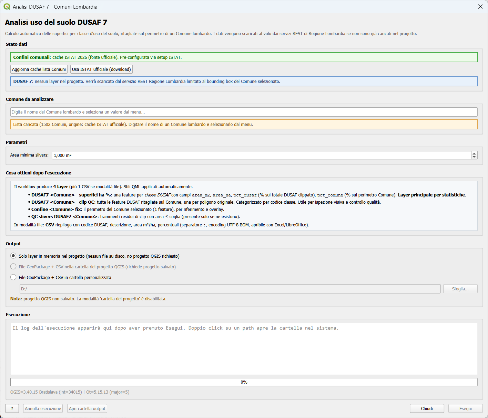
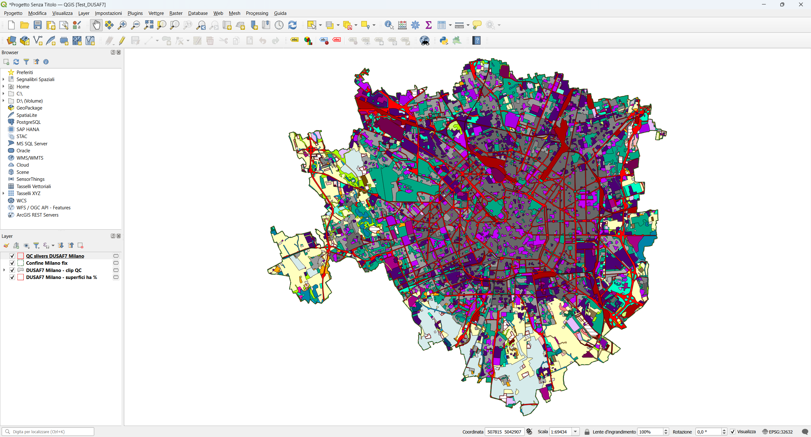
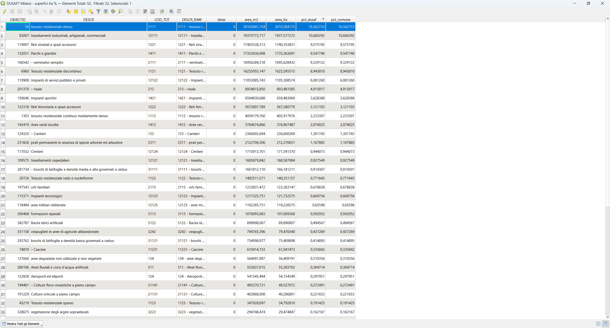
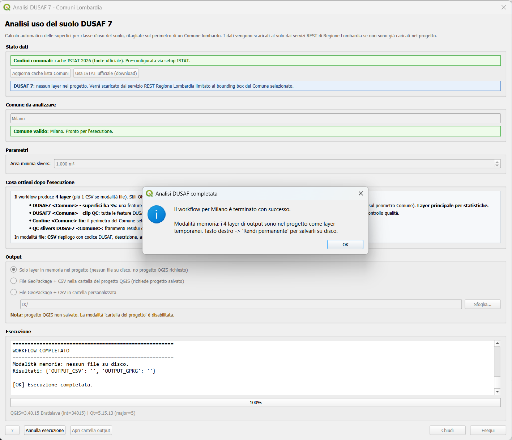

# QGIS Plugin DUSAF 7 - Comuni Lombardi

Plugin QGIS per l'analisi automatizzata dell'uso del suolo nei Comuni
lombardi, basato sul dataset **DUSAF 7.0** di Regione Lombardia e sui
**confini amministrativi** ufficiali.

A partire dalla versione 0.2.0 il plugin **non richiede più il
pre-caricamento manuale dei layer**: i dati vengono recuperati al volo
dai servizi REST ufficiali di Regione Lombardia, con cache locale nel
profilo QGIS e con un'opzione per usare i confini ufficiali ISTAT come
fonte autoritativa.

## Screenshots

### Dialog principale

Pannello "Stato dati" con badge verde/azzurro/rosso, autocomplete del
Comune case-insensitive, parametri (soglia slivers), sezione che
spiega cosa ottieni dopo l'esecuzione, scelta modalità output
(memoria / cartella progetto / cartella personalizzata), log live e
progress bar.



### Output sulla mappa

Esempio di esecuzione su **Milano**: i 4 layer di output appaiono
nel progetto con gli stili QML applicati automaticamente. Bordo rosso
del Comune sovrapposto alla simbologia categorizzata di DUSAF 7.



### Tabella attributi per classe

Il layer principale `DUSAF7 <Comune> - superfici ha %` contiene una
feature per ogni classe DUSAF presente nel Comune, con le statistiche
aggregate: `area_m2`, `area_ha`, `pct_dusaf` (% sul totale DUSAF
clippato) e `pct_comune` (% sul perimetro del Comune).



### Messaggio di completamento

Al termine il plugin riepiloga i percorsi dei file di output e (in
modalità memoria) ricorda all'utente che i layer sono temporanei e
possono essere resi permanenti dal menu contestuale.



## Compatibilità

- **QGIS**: 3.34 → 4.99
- **Qt**: 5 e 6
- Nessuna dipendenza Python esterna (solo `urllib` standard library)

## Installazione

1. Scarica lo ZIP dalla sezione Release del repository.
2. In QGIS: `Plugin → Gestisci e installa plugin → Installa da ZIP`.

## Come funziona

### Apertura

Click sul pulsante <kbd>Analisi DUSAF 7 - Comune Lombardo</kbd> nella
barra strumenti di QGIS (icona albero/foglia). Si apre il dialog
principale.

L'algoritmo Processing resta disponibile in
`Processing Toolbox → Analisi DUSAF 7 → Analisi Territoriale` per chi
preferisce richiamarlo da Model Designer o da script Python.

### Stato dati

Il pannello "Stato dati" indica per ciascuna fonte (Confini comunali,
DUSAF 7) da dove verranno presi i dati:

| Badge | Significato |
|---|---|
| 🟢 verde *layer di progetto* | Esiste già nel progetto un layer riconosciuto (back-compat). Usato as-is. |
| 🟢 verde *cache ISTAT 2026* | È stata configurata la cache ISTAT ufficiale tramite il setup opzionale. |
| 🔵 azzurro *REST Regione Lombardia* | Default: i dati verranno scaricati al volo dal servizio REST RL. |

Priorità: **progetto → cache ISTAT → REST RL**.

### Lista Comuni

Al primo avvio la lista dei ~1500 Comuni lombardi viene scaricata
dal servizio REST e salvata in cache nel profilo QGIS
(`<profile>/analisi_dusaf7_comune_lombardo/cache/comuni_list_lombardia.json`,
TTL 30 giorni). Avvii successivi caricano la lista istantaneamente.

Il pulsante <kbd>Aggiorna cache lista Comuni</kbd> forza un nuovo
fetch ignorando la cache.

L'autocomplete è case-insensitive e a match per sottostringa: digitando
"zibido san" trovi "Zibido San Giacomo".

### Setup ISTAT opzionale

Click su <kbd>Usa ISTAT ufficiale (download)</kbd> per aprire il
setup opzionale. Il dialog guida la procedura una tantum:

1. **Apri pagina ISTAT** → si apre il browser sulla pagina ufficiale.
2. **Sfoglia ZIP** → seleziona lo ZIP scaricato (`Limiti01012026.zip`
   o simile).
3. **Estrai e prepara** → il plugin valida lo ZIP, estrae i file nella
   cache locale e aggiorna il manifest.

Da quel momento il flusso usa **ISTAT come fonte primaria** sia per
l'autocomplete sia per la geometria del Comune. Il pulsante
<kbd>Rimuovi cache ISTAT</kbd> torna al default REST RL.

### Esecuzione

1. Digita e seleziona il Comune dall'autocomplete (alert verde =
   pronto).
2. Regola la soglia *Area minima slivers* se necessario (default
   `1.0 m²`).
3. Spunta o togli *Carica i 4 layer di output nel progetto* (default
   ON: i layer vengono aggiunti alla TOC con stili applicati).
4. Click <kbd>Esegui</kbd>. Il log scorre in tempo reale; il pulsante
   <kbd>Annulla esecuzione</kbd> interrompe pulitamente.

Tempo tipico per un Comune medio (~25 km²): **~5 secondi** in modalità
REST puro, **~10-30 secondi** se DUSAF è pre-caricato come layer di
progetto Lombardia-wide (back-compat) grazie al pre-filtro bbox.

## Output

I file vengono salvati nella sottocartella
`output_dusaf7_<nome_comune>/` della cartella del progetto QGIS attivo:

| File | Contenuto |
|---|---|
| `<comune>_dusaf7_<timestamp>.gpkg` | GeoPackage multilayer (superfici per classe, clip QC, confine, slivers) |
| `<comune>_dusaf7_superfici_<timestamp>.csv` | Riepilogo per classe DUSAF: codice, descrizione, area m²/ha, percentuali (separator `;`, UTF-8 BOM) |

Quando la checkbox è attiva, i quattro layer vengono caricati nel
progetto QGIS con stili QML applicati:

- **DUSAF7 - clip QC.qml**: categorizzato per `COD_TOT` (classe DUSAF)
- **DUSAF7 - superfici.qml**: bordo rosso, fill trasparente
- **Confine.qml**: perimetro comunale
- **QC slivers DUSAF7.qml**: frammenti residui di clip

Gli stili vengono cercati prima nella cartella `stili/` del progetto
QGIS (override utente), poi nella cartella `stili/` del plugin (default).

## Workflow tecnico (9 fasi)

1. Fix geometries Comuni
2. Riproiezione Comuni in EPSG:32632
3. Estrazione del Comune indicato (filtro nome + Regione Lombardia)
4. Preparazione DUSAF: risoluzione fonte, fix, reproject (con
   pre-filtro bbox quando da progetto)
5. Clip DUSAF sul perimetro comunale
6. Dissolve per classe DUSAF (`COD_TOT` + `DESCR`)
7. Data Audit QC-4 (tolleranza 1.0 m² su differenza perimetro vs
   superficie DUSAF aggregata)
8. Salvataggio GeoPackage + CSV
9. Caricamento layer di output con stili

## Fonti dati

| Dataset | Endpoint / URL | Note |
|---|---|---|
| Confini comunali RL | `cartografia.servizirl.it/arcgis/.../Ambiti_Amministrativi_Lombardia/MapServer/1` | Default, in EPSG:32632, ~1500 feature totali |
| DUSAF 7 RL | `cartografia.servizirl.it/arcgis1/.../territorio/dusaf7/MapServer/1` | EPSG:32632, paginazione 1000 record |
| Confini ISTAT 2026 | [pagina ISTAT](https://www.istat.it/notizia/confini-delle-unita-amministrative-a-fini-statistici-al-1-gennaio-2018-2/) | Opzionale, scaricato come ZIP shapefile |

### Nota tecnica su DUSAF REST

Il servizio REST RL espone solo `OBJECTID` + `DESCR` + geometria;
`COD_TOT` non è un campo separato ma è impacchettato nel prefisso di
`DESCR` (es: `"1111 - tessuto residenziale denso"`). Il plugin parsa
automaticamente codice e descrizione e li espone come campi
separati `COD_TOT` e `DESCR` sul layer in memoria, più `DESCR_RAW` per
audit. Per la massima precisione LIV5 conviene caricare nel progetto
il DUSAF7 desktop completo come back-compat.

## Cache locale

Tutta la cache vive nel profilo QGIS:

```
<profile>/analisi_dusaf7_comune_lombardo/cache/
├── manifest.json                          # metadata e timestamp
├── comuni_list_lombardia.json             # lista 1500 Comuni (TTL 30gg)
└── istat_boundaries/                      # opzionale
    └── extracted_2026/
        └── Com01012026/
            └── Com01012026_WGS84.shp + .dbf + .shx + .prj
```

Per ripulire tutto: `Modifica → Opzioni → Profili utente → Apri
cartella profilo attivo` e cancellare la cartella
`analisi_dusaf7_comune_lombardo`.

## Struttura del repository

```
analisi_dusaf7_comune_lombardo/
├── analisi_dusaf7_comune_lombardo.py        # plugin entry, toolbar action
├── analisi_dusaf7_comune_lombardo_provider.py
├── analisi_dusaf7_comune_lombardo_algorithm.py  # algoritmo Processing
├── compat.py                                # shim Qt5/Qt6, QGIS 3.34→4.x
├── data_sources/                            # client REST + cache
│   ├── cache_manager.py
│   ├── comuni_list_cache.py
│   ├── istat_boundaries_client.py           # ISTAT ZIP setup/validate
│   ├── layer_factory.py                     # GeoJSON → QgsVectorLayer
│   ├── lombardia_comuni_client.py           # REST RL confini
│   └── lombardia_dusaf_client.py            # REST RL DUSAF
├── workflow/                                # pipeline pura
│   ├── data_resolver.py                     # bridge project/cache/REST
│   ├── pipeline.py                          # fix, reproject, clip, ...
│   ├── qc.py                                # geometry QC, area calc
│   └── output.py                            # GPKG/CSV writers, stili
├── ui/                                      # dialog Qt
│   ├── main_dialog.py
│   └── istat_setup_dialog.py
├── stili/                                   # QML
└── metadata.txt
```

## Licenza

Codice Python distribuito con licenza **AGPL-3.0**.

Gli stili QML DUSAF riprendono/adattano la simbologia del dataset
DUSAF 7.0 di Regione Lombardia, con attribuzione alla fonte.

## Changelog

### 0.2.0 (Maggio 2026)

- ✅ **REST-driven workflow**: il plugin funziona senza pre-caricamento
  dei layer DUSAF e Comuni.
- ✅ **Compatibilità Qt5/Qt6 e QGIS 3.34→4.99** (era 3.40 only).
- ✅ **Dialog principale** moderno con stato dati, autocomplete
  case-insensitive, log live e progress bar.
- ✅ **Setup ISTAT opzionale**: cache di confini ufficiali ISTAT 2026
  come fonte autoritativa.
- ✅ **Cache locale** lista Comuni con TTL 30gg per autocomplete
  istantaneo.
- ✅ **Pre-filtro DUSAF per bbox** anche in back-compat (no più
  processing dell'intera Lombardia).
- ✅ **Parsing intelligente** del campo DUSAF DESCR (REST RL non
  espone COD_TOT separato).
- ✅ **Refactor**: workflow estratto in `workflow/` (pipeline, qc,
  output), client REST in `data_sources/`, UI in `ui/`.

### 0.1.0 (versione iniziale)

- Plugin Processing minimale, richiede DUSAF7 e Com01012026_WGS84 già
  caricati nel progetto.
